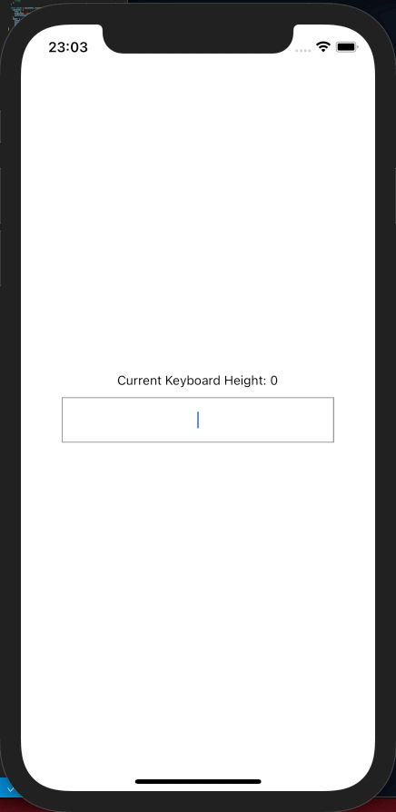

# react-native-use-keyboard-height

a simple hook to get keyboard height while it's shown in react-native



## Installation

```sh
npm install react-native-use-keyboard-height
```

## Usage

```js
import React from 'react';
import { StyleSheet, View, Text, TextInput } from 'react-native';
import useKeyboardHeight from 'react-native-use-keyboard-height';

export default function App() {
  const keyboardHeight = useKeyboardHeight(); // both ios and android
  // const keyboardHeight = useKeyboardHeight(['ios', 'android']); // both ios and android
  // const keyboardHeight = useKeyboardHeight(['ios']); // only ios
  // const keyboardHeight = useKeyboardHeight(['android']); // only android
  return (
    <View style={styles.container}>
      <Text>Current Keyboard Height: {keyboardHeight}</Text>
      <TextInput style={styles.input}></TextInput>
    </View>
  );
}

const styles = StyleSheet.create({
  container: {
    flex: 1,
    alignItems: 'center',
    justifyContent: 'center',
  },
  input: {
    width: 300,
    height: 50,
    borderWidth: 1,
    borderColor: 'grey',
    textAlign: 'center',
    marginTop: 10,
  },
});
```

## Contributing

See the [contributing guide](CONTRIBUTING.md) to learn how to contribute to the repository and the development workflow.

## License

MIT
